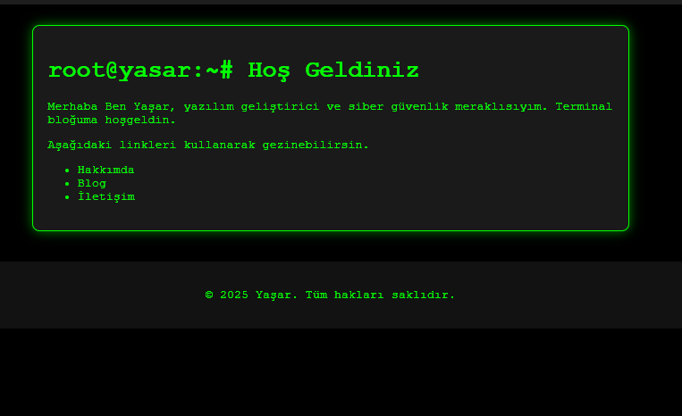
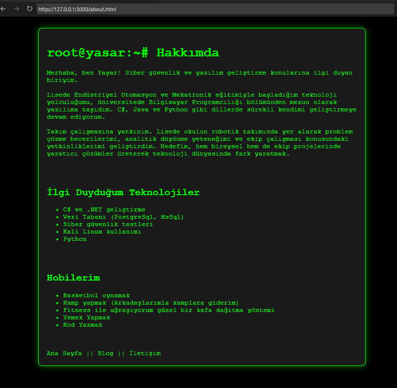
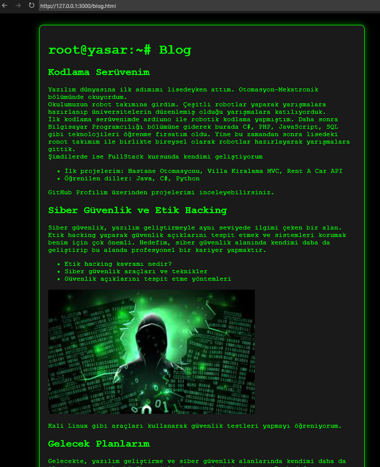
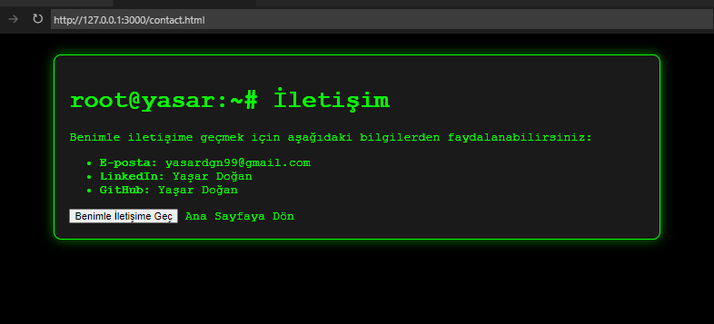

# Patika+ Kişisel Blog Sayfası Oluşturma: Terminal Blog Projesi
Bu proje, kişisel bir blog sayfası oluşturmak için HTML, CSS ve JavaScript kullanarak geliştirilmiştir. Temada, siber güvenlik ve yazılım geliştirme konularına ilgi duyan bir yazılımcının "Terminal" tarzında bir blog sunması hedeflenmiştir.

## Proje Özellikleri

- **HTML5 Temel Yapısı:** Sayfa yapısı, HTML5 doküman yapısı kullanılarak oluşturulmuştur.
- **Matrix Tarzı Kayan Yazılar:** Sayfanın üst kısmında, hızlıca kayan 0 ve 1'lerden oluşan yazılarla terminal tarzı bir efekt oluşturulmuştur.
- **Siyah Arka Plan ve Yeşil Yazılar:** Terminal havası yaratmak için siyah arka plan ve yeşil renkli yazılar kullanılmıştır.
- **Sayfalar:** Ana sayfa, hakkımda sayfası, blog sayfası ve iletişim sayfası içermektedir.
- **CSS Animasyonları:** Terminal yazılarının yanında dinamik kayan yazı efektleri kullanılmıştır.

## Sayfalar

1. **Ana Sayfa (index.html):**
   - Terminal tarzı "Hoş geldiniz" mesajı.
   - Kendini tanıtan bir yazı.
   - Diğer sayfalara bağlantılar (Hakkımda, Blog, İletişim).

2. **Hakkımda Sayfası (about.html):**
   - Siber güvenlik ve yazılım geliştirme ile ilgilendiğiniz alanlar hakkında bilgi.
   - Kendi projelerinizden bahsedildiği kısa bir açıklama.
   - GitHub ve LinkedIn gibi bağlantılar.

3. **Blog Sayfası (blog.html):**
   - "Kodlama Serüvenim" – Yazılıma nasıl başladığınızı anlatan yazı.
   - "Siber Güvenlik ve Etik Hacking" – Siber güvenlik ile ilgilenmeye nasıl başladığınızı anlatan yazı.
   - "Gelecek Planlarım" – Kendi projeleriniz ve hedeflerinizi içeren yazı.

4. **İletişim Sayfası (contact.html):**
   - E-posta ve sosyal medya linkleri.
   - "Benimle İletişime Geç" butonu.

## Kullanılan Teknolojiler

- **HTML5** - Sayfa yapısını oluşturmak için.
- **CSS3** - Stil ve animasyonlar için.

## Ekran Görüntüleri
1.index.html:

2.about.html:

3.blog.html:

4.contact.html:

