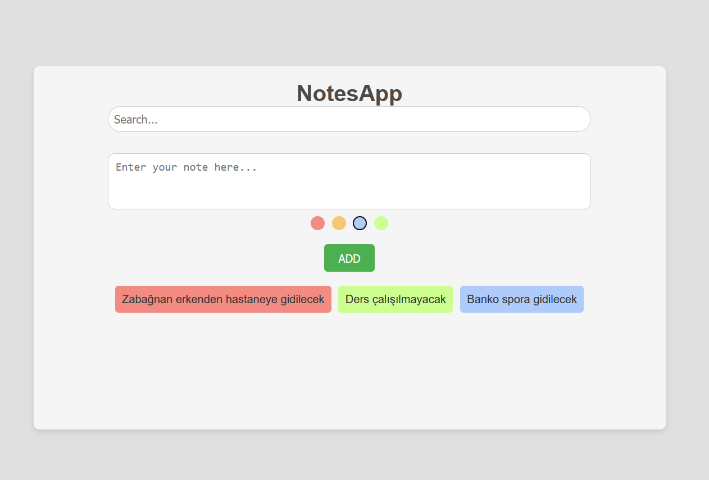

# NotesApp Projesi

Bu proje, kullanıcıların not eklemesine, düzenlemesine ve filtrelemesine olanak tanıyan basit ve renkli bir not alma uygulamasıdır. Kullanıcılar her not için renk seçebilir, bu da notların kategorize edilmesini ve görsel olarak ayırt edilmesini kolaylaştırır.

## Proje Amacı

Bu uygulamanın amacı, not oluşturma ve yönetme konusunda kullanıcı dostu bir arayüz sunmaktır. Kullanıcıların düşüncelerini, görevlerini veya fikirlerini eğlenceli ve görsel olarak çekici bir şekilde organize etmelerine yardımcı olacak şekilde tasarlanmıştır.

## Özellikler

- **Not Oluşturma**: Kullanıcılar, giriş alanını kullanarak not yazabilir ve kaydedebilir.
- **Renk Seçimi**: Her nota organizasyon ve önceliklendirme amacıyla bir renk atanabilir.
- **Not Filtreleme**: Arama özelliği sayesinde notlar içeriğe göre filtrelenebilir.
- **Duyarlı Tasarım**: Masaüstü ve mobil cihazlarda sorunsuz bir kullanıcı deneyimi için farklı ekran boyutlarına uyum sağlar.

## Kullanılan Teknolojiler

- **React**: Dinamik bir kullanıcı arayüzü oluşturmak için bileşen tabanlı yapı.
- **JavaScript**: Etkileşimli öğeler ve not yönetimi mantığını sağlar.
- **CSS**: Görsel olarak çekici bir düzen oluşturur ve kullanıcı deneyimini geliştirir.
- **HTML**: Uygulamanın temel yapısını oluşturur.

## Ekran görüntüsü:
