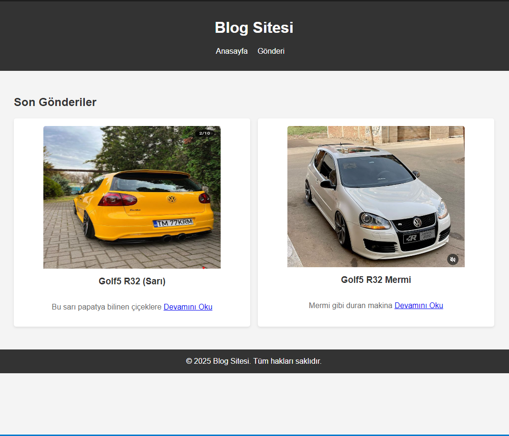
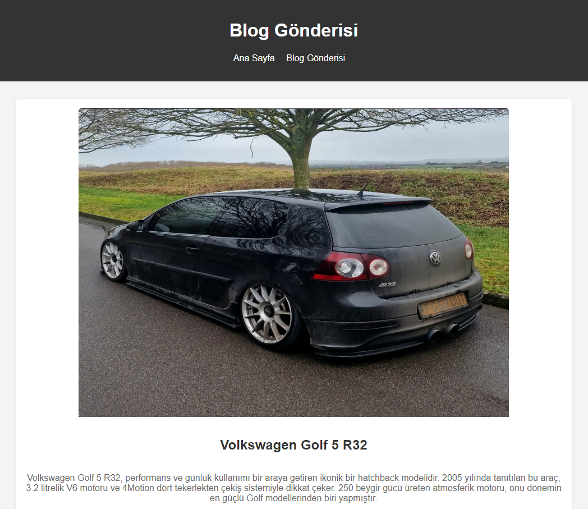

# Blog Sitesi Ödevi

Bu proje, HTML ve CSS kullanarak basit bir blog sitesi oluşturmayı amaçlamaktadır. Blog sitesi, bir ana sayfa ve en az bir blog gönderisi sayfası içermektedir.

## Proje Tanımı

Bu ödev kapsamında, aşağıdaki teknik ve fonksiyonel gereksinimlere sahip basit bir blog sitesi oluşturulmuştur.

## Teknik Gereksinimler

- **HTML**: Yapısal belge işaretleme dili olarak HTML kullanılmıştır.
- **CSS**: Stil vermek için CSS kullanılmıştır.

### Dosya Yapısı

- **index.html**: Ana sayfa
- **post.html**: Blog gönderisi sayfası
- **styles.css**: Stil dosyası
- **img**: Resimlerin bulunduğu klasör

## Fonksiyonel Gereksinimler

### Ana Sayfa (index.html)

- **Başlık**: Sayfanın başında büyük bir başlık (`<h1>`) bulunur.
- **Menü**: Ana sayfada, ana sayfaya ve blog gönderisi sayfasına yönlendiren bağlantılar (`<nav>` ve `<ul>` kullanılarak) bulunur.
- **Son Gönderiler**: En az iki blog gönderisinin özetini (`<article>` kullanarak) listeledik. Her özet, tam blog gönderisine bağlantı içerir.
- **Footer**: Sayfanın altında bir footer (`<footer>`) bulunur. İçinde telif hakkı bilgisi yer alır.

### Blog Gönderisi Sayfası (post.html)

- **Başlık**: Sayfanın başında büyük bir başlık (`<h1>`) bulunur.
- **Menü**: Ana sayfaya ve blog gönderisi sayfasına yönlendiren bağlantılar (`<nav>` ve `<ul>` kullanılarak) bulunur.
- **Blog İçeriği**: Tam blog gönderisi içeriği (`<article>` ve `
` kullanarak) görüntülenir.
- **Footer**: Sayfanın altında bir footer (`<footer>`) bulunur. İçinde telif hakkı bilgisi yer alır.

## Görsel Gereksinimler

### Renk Paleti

- **Arka Plan**: #f4f4f4
- **Başlık ve Footer**: #333 (koyu gri)
- **Metin**: #333 (başlıklar) ve #666 (paragraflar)

### Ekran Görüntüleri

- **index.html**:

- **post.html**:
