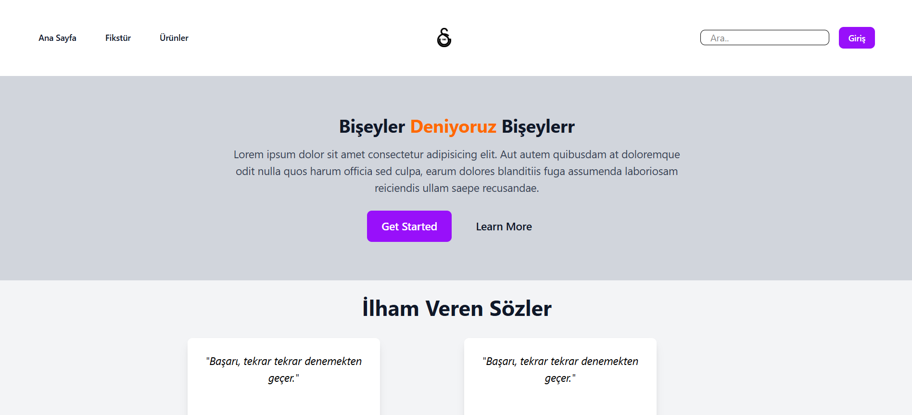
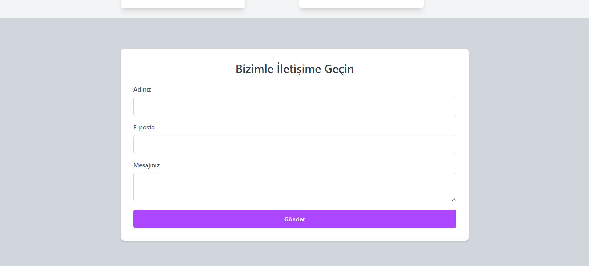

# Tailwind ReviewPage Ödevi

Bu proje, HTML - Tailwind CSS kullanarak basit bir blog sitesi oluşturmayı amaçlamaktadır.

## Teknik Gereksinimler

- **HTML**: Yapısal belge işaretleme dili olarak HTML kullanılmıştır.
- **Tailwind CSS**: Stil vermek için Tailwind CSS kullanılmıştır.

### Dosya Yapısı

- **index.html**: Ana sayfa
- **img**: Resimlerin bulunduğu klasör

### Ekran Görüntüleri

