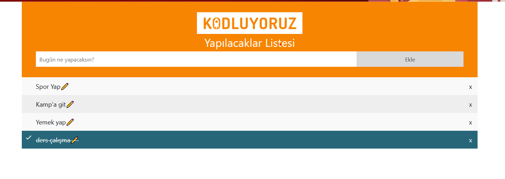

To-Do List Uygulaması

Bu proje, JavaScript ve LocalStorage kullanarak geliştirilmiş bir To-Do List (Yapılacaklar Listesi) uygulamasıdır.

Özellikler

✅ Görev ekleme

✅ Görevleri tamamlandı olarak işaretleme

✅ Görev güncelleme

✅ Görevleri silme

✅ LocalStorage ile verileri saklama

✅ Bootstrap ile bildirim (Toast) gösterme

Kullanılan Teknolojiler

HTML

CSS

JavaScript

Bootstrap

LocalStorage

Kullanım

Görev eklemek için giriş kutusuna metin yazın ve "Ekle" butonuna basın.

Görevleri tamamlandı olarak işaretlemek için görevin üzerine tıklayın.

Bir görevi güncellemek için "✏️" butonuna tıklayın.

Görevi silmek için "x" butonuna tıklayın.

Görseller

📌 Örnek Ekran Görüntüsü:
